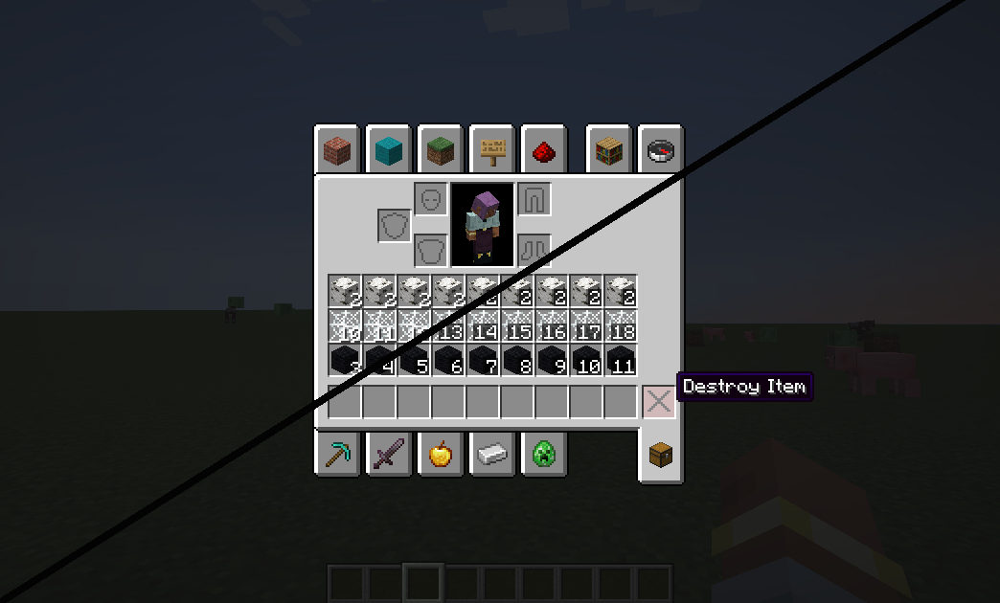
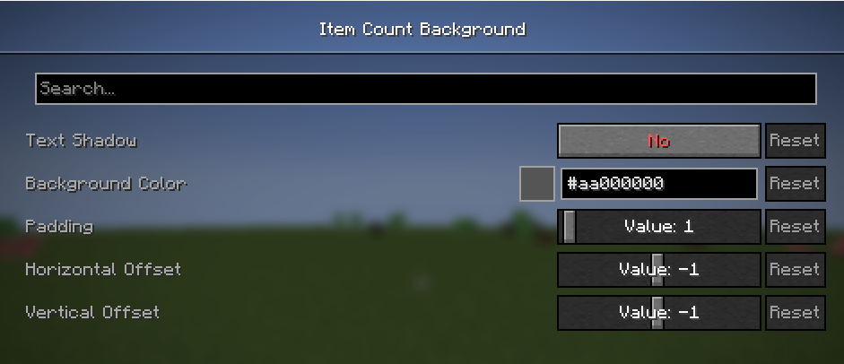

# Item Count Background

## Config

- **Text Shadow:** Enables/disables the text shadow present by default on the item count text (and expands the background accordingly)
- **Background Color:** Color that the background will be rendered with (RGBA format)
- **Padding:** Pixel padding added on every side
- **Horizontal Offset:** X-coordinate offset applied to the *item count*, including both text and background
- **Vertical Offset:** Y-coordinate offset applied to the item count